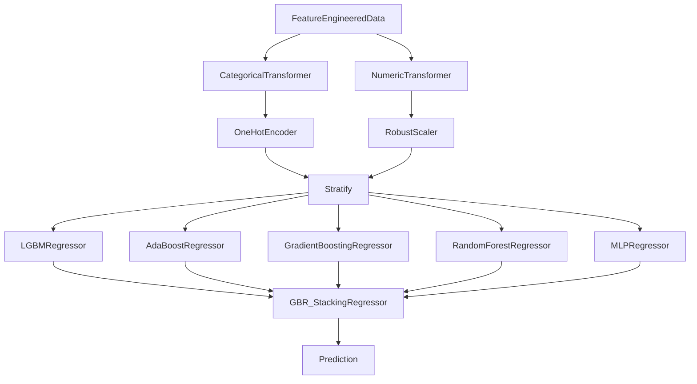

  

<h1 align="center">TOUR Championship Analysis</h1>

<!-- TABLE OF CONTENTS -->

  
Table of Contents

  <ol>
    <li><a href="#Objectives">Objectives</a></li>
    <li><a href="#Repo-Overview">Repo Overview</a></li>
    <li><a href="#Code-Quality">Code Quality</a></li>
    <li><a href="#Dataset">Dataset</a></li>
    <li><a href="#EDA">EDA</a></li>
    <ol>
    <li><a href="#SG-per-Round">SG per Round</a></li>
    <li><a href="#SG-per-Hole">SG per Hole</a></li>
    <li><a href="#SG-per-Drive">SG per Drive</a></li>
    </ol>
    <li><a href="#Expected-Strokes-Model">Expected Strokes Model</a></li>
    <ol>
    <li><a href="#Model-Selection">xS Model Selection</a></li>
    <li><a href="#Model-Hyper-Parameterization">xS Model Hyper Parameterization</a></li>
    <li><a href="#Model-Explainability">xS Model Explainability</a></li>
    <li><a href="#Model-Architecture">xS Model Architecture</a></li>
    <li><a href="#Model-Performance">xS Model Performance</a></li>
    </ol>
    <li><a href="#Applying-xS-Model">Applying xS Model</a></li>
    <ol>
    <li><a href="#SG-per-Shot">SG per Shot</a></li>
    </ol>
    <li><a href="#Conclusion">Conclusion</a></li>
    <li><a href="#Future-Roadmap">Future Roadmap</a></li>
  </ol>

## **🎯 Objectives**

Welcome to my analysis of the 2011 TOUR Championship at East Lake Golf Club, the primary objective of this project is to:
> **Develop an expected strokes model to identify player performance**

I hope to contribute meaningful insights to the golf community through this project. Although the 2011 TOUR Championship took place over a decade ago and the tournament's rules have since changed, its extensive shot-level dataset remains a valuable resource. If you happen to come across another complete shot-level dataset, I would greatly appreciate it if you could share it with me! I encourage you to check out the js visuals on [NBViewer!](https://nbviewer.org/github/dec1costello/TOUR-Championship-Strokes-Gained-Analysis/tree/main/)

## **🌵 Repo Structure**

This repo is organized as follows:

    📂 TOUR-Championship-Strokes-Gained-Analysis 📍
    │
    ├── 📂 Data
    ├── CITATION
    ├── README.md
    ├── CODE_OF_CONDUCT.md
    │
    ├── 📂 EDA
    │   ├── EDA.ipynb
    │   ├── 📂 EDAUtils
    │   ├── SGperHole.ipynb
    │   ├── SGperRound.ipynb
    │   ├── SGperDrive.ipynb
    │   ├── FeatureEngineering.ipynb
    │   └── EDAUtils-1.2-py2.py3-none-any.whl
    │
    ├── 📂 Creating Model
    │   ├── LazyPredict.ipynb 
    │   └── Final_Putting_Model.ipynb
    │
    └── 📂 Applying Model
        └── xSG.ipynb

## **⭐ Code Quality**

In this project, a Security Linter, Code Formatting, Type Checking, and Code Linting are essential for ensuring code quality and robustness. These help identify and mitigate security vulnerabilities, maintain consistent coding styles, enforce type safety, and detect potential errors or issues early in the development process, ultimately enhancing the reliability and maintainability of the project.

| Security Linter | Code Formatting | Type Checking | Code Linting |
| ------------------------------------------- | -------------------------------------------------- | ---------------------------------------- | ------------------------------------------- |
| [`bandit`](https://github.com/PyCQA/bandit) | [`ruff-format`](https://github.com/astral-sh/ruff) | [`mypy`](https://github.com/python/mypy) | [`ruff`](https://github.com/astral-sh/ruff) |

## **📊 Dataset**

This dataset consists of shot level data from the PGA TOUR Championship. The TOUR Championship differs from other tournaments in that only the top 30 golfers compete and there's no cut after the second round, this ensures consistent data of high skill golfers across all 4 rounds. Additionally, it's important to acknowledge that the dataset lacks [data from the playoff that occurred](https://www.youtube.com/watch?v=vRjNR1T81VE), which is crucial for understanding the tournament's conclusion. Furthermore, it is important to emphasize that landing in the rough at East Lake doesn't necessarily disadvantage a player. Despite the challenge it presents, the ball could still have a favorable lie, which might have been strategically chosen by the golfer.

## 🔍 EDA

I analyze the data, focusing on feature engineering to understand, clean, and refine the dataset. This process guides model selection and validates assumptions, while also uncovering insights through visualization. By addressing data quality and recognizing patterns early on, I establish a solid foundation for the project. For instance, exploring Strokes Gained (SG) at the round, hole, and drive levels helps us make assumptions for building a model to examine SG on a shot-level basis later.

 
 

### SG per Round

I analyze the Strokes Gained distribution for each round of the Championship, revealing player performance trends during the tournament. This examination on a round-by-round basis helps uncover patterns in golfers' strategies and identifies challenges posed by difficult pin locations on the course.

#### Key Insights

* All rounds have a promising mean of 0
* Round 3 seemed to be the most chaotic, as there was a significant variance in player performance throughout the day

  

(<a href="#readme-top">back to top</a>)

### SG per Hole

In this analysis, I investigate the distribution of Strokes Gained for each hole of every round of the Championship. Notably, Mahan ties Haas in Strokes Gained on the 72nd hole, a significant moment in the tournament. However, [Haas ultimately secured victory in the playoffs!](https://www.espn.com/golf/leaderboard?tournamentId=917)

#### Key Insights

* Players appear to continue to play relative to their initial performance of round 1
* Poorly performing players seem to give up come the back 9 of round 3

  

(<a href="#readme-top">back to top</a>)

### SG per Drive

Here I explore the distribution of Strokes Gained vs Driving Distance Gained (DG) and Driving Accuracy Gained (AG) for each drive of the Championship. Both DG and SG are normalized per hole before totalling. Happy to say my analysis aligns with [Data Golf's Course Fit Tool.](https://datagolf.com/course-fit-tool)

#### Key Insights

* AG has a strong correlation to SG
* DG has only a slight correlation to SG

  

(<a href="#readme-top">back to top</a>)

## 🎨  Expected Strokes Model

The Stacked Expected Strokes Model leverages the power of ensemble learning by combining predictions from multiple base models to enhance accuracy and robustness. Notably, I've developed separate models for putting and non-putting scenarios, utilizing different input features tailored to each situation. This approach allows for more precise predictions by optimizing the model's focus on specific aspects of gameplay, ultimately leading to improved performance and insights in golf analytics. Furthermore, this model will eventually enable a granular analysis of shot-by-shot Strokes Gained, a significant departure from previous hole-by-hole and round-by-round evaluations. By harnessing the Stacked Expected Strokes Model's predictive capabilities, I'll unlock the ability to evaluate each shot's impact on overall performance, offering unprecedented insights into golfer performance. Additionally, I'm unconcerned about data leakage since I'll be predicting continuous variables while training on discrete data, ensuring the model's integrity and effectiveness in real-world applications.

 
 

### Model Selection

While the training data is discrete, for continuous predictions, I faced the task of selecting between regression models. As with all my models, I was sure to stratify the training and testing data before predicting. Initially, I employed [Lazy Predict](https://lazypredict.readthedocs.io/en/latest/) to assess various model options comprehensively.

#### Key Insight

* The GradientBoostingRegressor and HistGradientBoostingRegressor models performed the best
* If I were to have to constantly retrain the model I would avoid the MLPRegressor as it takes forever

  

| Model  | Adjusted R-Squared | R-Squared	| RMSE | Time Taken |
|-----------------------------------|-------|--------|-------|-------|
| GradientBoostingRegressor         | 0.85  | 0.85   | 0.46  | 0.93  |
| HistGradientBoostingRegressor     | 0.85  | 0.85   | 0.46  | 0.60  |
| LGBMRegressor                     | 0.85  | 0.85   | 0.47  | 0.14  |
| MLPRegressor                      | 0.84  | 0.84   | 0.48  | 5.23  |
| KNeighborsRegressor               | 0.82  | 0.83   | 0.50  | 0.16  |
| AdaBoostRegressor                 | 0.82  | 0.83   | 0.50  | 0.49  |
| RandomForestRegressor             | 0.82  | 0.82   | 0.50  | 3.46  |
| XGBRegressor                      | 0.82  | 0.82   | 0.50  | 0.24  |
| BaggingRegressor                  | 0.81  | 0.81   | 0.52  | 0.37  |
| NuSVR                             | 0.81  | 0.81   | 0.52  | 3.58  |
| ExtraTreesRegressor	              | 0.80  | 0.80   | 0.53  | 2.02  |
| SVR                               | 0.80  | 0.80   | 0.53  | 3.35  |

(<a href="#readme-top">back to top</a>)

### Model Hyper Parameterization

Model hyper parameterization plays a crucial role in optimizing machine learning models for performance and generalization. By systematically searching through the hyperparameter space, we can find the combination of hyperparameters that yields the best model performance on validation data. In this project, I leveraged the [Optuna](https://optuna.org/#dashboard) library for Bayesian optimization, enabling an efficient and automated search for the optimal hyperparameters of the models. This proactive approach ensures that our models are fine-tuned to achieve their highest potential performance, leading to better predictive accuracy and robustness.

#### Key Insight
* Hyper parameter tuning greatly improved each model of my stacking regressor

  

(<a href="#readme-top">back to top</a>)

### Model Explainability

For model explainability, I utilized the [SHap library](https://shap.readthedocs.io/en/latest/example_notebooks/overviews/An%20introduction%20to%20explainable%20AI%20with%20Shapley%20values.html) to analyze the stack model's estimators and base models, offering insights into feature importance. However, to ensure a comprehensive analysis, I also delved into [permutation importance](https://medium.com/@syoussefi600/permutation-importance-vs-impurity-based-feature-importance-1c1a8d027479) as an additional metric in the notebook. This approach allowed for a thorough examination of feature importance from different perspectives, enriching our understanding of the model's predictive behavior. Finally, I employed the [Lime library](https://github.com/marcotcr/lime)  to evaluate the complete stacking regressor's feature importance. Below, you'll find a SHap charts for the putting model's LGBMRegressor.

#### Key Insight
* Super surprised to see "Distance to Edge" matters more than "Distance to Pin" for putting, curious if this would be the case if I had a larger dataset
* "Downhill Slope" and "Elevation Below Ball" are distinct features; Despite their seemingly similar title, they are not the same. To confirm this, a pairwise correlation was done

  

(<a href="#readme-top">back to top</a>)

### Model Architecture

Here I explore the relationship between 'Distance to the Pin' & 'Lie' vs 'Strokes to Hole Out' at the Tour Championship. I Ensemble the top  performing models together using a [Stack](https://scikit-learn.org/stable/modules/generated/sklearn.ensemble.StackingRegressor.html) to minimize [Bias](https://towardsdatascience.com/a-quickstart-guide-to-uprooting-model-bias-f4465c8e84bc) and [Variance](https://x.com/akshay_pachaar/status/1703757251474063861?s=20). This iterative process maximized predictive accuracy of Expected Strokes(xS).

#### Key Insight

* Excited to use [ML Flow](https://medium.com/infer-qwak/building-an-end-to-end-mlops-pipeline-with-open-source-tools-d8bacbf4184f) to test out the performance of different model architectures

(<a href="#readme-top">back to top</a>)

### Model Performance

This chart helps evaluate the model by showing how predicted values compare to actual ones and revealing patterns in prediction errors. The histogram below assesses if errors follow a normal distribution, crucial for reliable predictions.

#### Key Insight

* Excited to see the residuals have a low standard deviation with a mean hovering around 0

  

(<a href="#readme-top">back to top</a>)

## 📝 Applying xS Model

Now that we have a stacked SG machine learning model for a shot per shot basis, implementing it is crucial for gaining valuable insights into golf performance. Utilizing the model post-training enables golf analysts, coaches, and players to extract actionable insights, optimize strategies, and refine skills. Ultimately, leveraging a model empowers stakeholders to make informed decisions, enhance performance, and drive success on the golf course.

### SG per Shot

Now that we have a reliable model, we can use it to identify a player's strengths and weaknesses by subtracting Expected Strokes (xS) from the result of each shot to give us true Strokes Gained (SG). This plot displays Baddeley's SG by shot type, providing a clear visualization of his performance across different lies and distances.

#### Key Insight

* Excited to document the number of shots from each condition as well as the mean distance and standard deviation to the hole for each Shot Type bucket (plan to label it in the plot). This way we could see if he truly underperform from the rough from that 150 – 200 yardage or did he just have only a few shots and they ended up being in the top end of the bucket

  

(<a href="#readme-top">back to top</a>)

## 🎬 Conclusion

It was cool to combine my passions for data science and golf into this project, wish I knew about Strokes Gained back when I was a caddy! Hope to do more golf projects in the future. Thanks for reading big dog.

(<a href="#readme-top">back to top</a>)

<!-- ROADMAP -->
## 🗺️ Future Roadmap

- [ ] xS Stack Model Refinement
    - [x] Create Putting Model
    - [ ] Model Registry
        - [x] [Refer To](https://medium.com/infer-qwak/building-an-end-to-end-mlops-pipeline-with-open-source-tools-d8bacbf4184f)
        - [x] [Watch](https://www.youtube.com/watch?v=-7XegzgjgM0&list=PLQqR_3C2fhUUkoXAcomOxcvfPwRn90U-g&index=8)
        - [ ] [Utilize](https://community.cloud.databricks.com/?o=5379878152283690)
    - [ ] Drift Detection
        - [ ] [Evidently](https://www.youtube.com/watch?v=L4Pv6ExBQPM)
        - [ ] [Whylogs](https://github.com/whylabs/whylogs)
    - [ ] CI Orchestration
        - [ ] [CML](https://cml.dev/)
- [ ] Add External Data
    - [ ] Player Course History
    - [ ] [Career Earnings](https://www.spotrac.com/pga/rankings/date/2011-01-01/2011-09-20/)
    - [ ] Equipment
    - [ ] Biometrics
    - [ ] [Weather](https://www.wunderground.com/history/daily/KATL/date/2011-9-22)
    - [ ] [SVGs](https://pgatour.bluegolf.com/bluegolfw/pgatour22/event/pgatour2210/course/eastlakegc/overview.htm)
    - [x] [HCP](https://pgatour.bluegolf.com/bluegolfw/pgatour22/event/pgatour2210/course/eastlakegc/detailedscorecard.htm)
- [ ] Data Viz
    - [ ] [SG Distributions](https://baseballsavant.mlb.com/visuals/statcast-pitch-distribution)
    - [ ] [Hole Heatmaps](https://datagolf.com/hole-heatmaps)
    - [ ] [Lie & SG Plinko](https://baseballsavant.mlb.com/visuals/pitch-plinko)
    - [ ] [Drive KDE](https://baseballsavant.mlb.com/player-comparison)
- [ ] Bayesian Integration
    - [x] [Refer To](https://colab.research.google.com/github/AllenDowney/ThinkBayes2/blob/master/examples/hockey.ipynb#scrollTo=B-c6bb9wO-Cs)
    - [x] [Watch](https://www.youtube.com/watch?v=Zi6N3GLUJmw)
    - [ ] [Utilize](https://colab.research.google.com/github/AllenDowney/ThinkBayes2/)
- [ ] [Dockerize & Deploy](https://sagemaker-examples.readthedocs.io/en/latest/sagemaker-python-sdk/scikit_learn_randomforest/Sklearn_on_SageMaker_end2end.html)

(<a href="#readme-top">back to top</a>)

